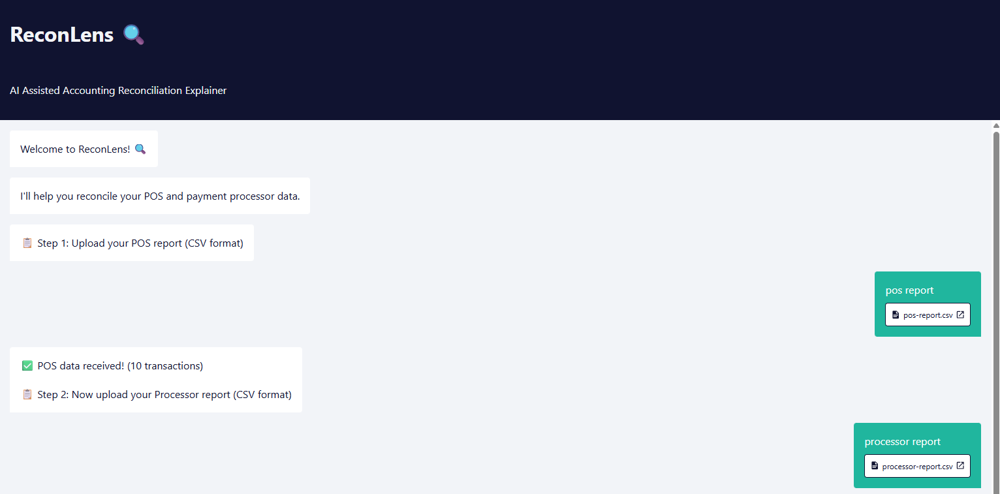
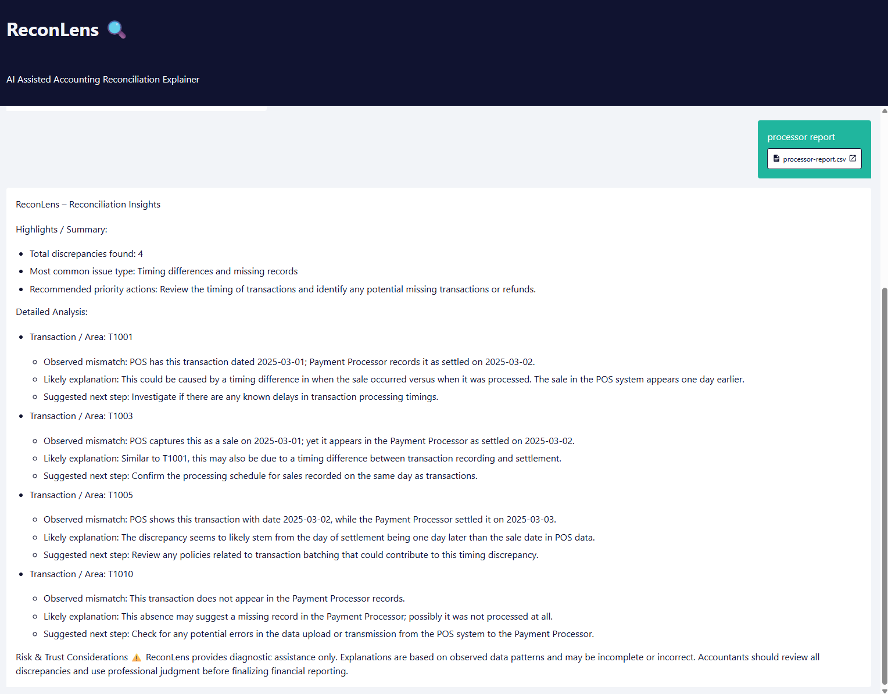

# ReconLens
AI-assisted reconciliation explainer for restaurant accounting teams

## Current status: Proof of Concept

This prototype validates one core assumption — that an LLM can cross-reference two structured transaction datasets and generate explainable root-cause insights.

It works with a constrained data format (limited columns, simplified schema) and has not yet been tested with real-world accounting reports or actual accountants.

The next validation step is user research with 3–5 restaurant accountants before investing in full MVP scope.

## The problem

Restaurant accounting teams reconcile financial data across POS systems, payment processors, and bank statements daily. While calculating discrepancies is straightforward, identifying *why* they exist is slow, manual, and does not scale.

As transaction volume grows, accountants spend days on root-cause analysis — chasing chargebacks, fee miscalculations, and timing differences across reports with inconsistent data schemas. This delays financial close and increases operational risk.

## What ReconLens does

ReconLens helps accounting teams diagnose *why* financial records don't reconcile. It cross-references uploaded transaction data, identifies mismatches, and generates plain-English root-cause explanations — reducing manual investigation without replacing human judgment.

> ⚠️ ReconLens is a diagnostic assistant, not an authoritative system. All explanations are clearly marked as probable causes, and the tool explicitly signals when human review is required.

## Prototype screenshots

The live prototype is currently offline. Screenshots below show the working POC.

**Step 1 — guided file upload flow:**

**Step 2 — reconciliation analysis output:**

## How it works

- Accountant uploads POS report (CSV) — the prototype guides them step by step
- Accountant uploads payment processor report (CSV)
- ReconLens cross-references the data and identifies mismatches
- For each mismatch, it surfaces a likely root cause using cautious, explainable language
- Accountant reviews and confirms before updating financial records

## What's in this repo

- `MVP Prototype.json` — n8n workflow powering the prototype, including LLM prompt and response formatting logic
- `pos-report.csv` — sample POS transaction data used for POC testing
- `processor-report.csv` — sample payment processor report used for POC testing
- `reconlens-step1-upload-files.png` — screenshot of the guided upload interface
- `reconlens-output-analysis.png` — screenshot of the reconciliation analysis output

## Product decisions worth noting

- **File upload only (no integrations):** Keeps MVP scope tight and avoids third-party API dependencies. Integration is a post-MVP enhancement once adoption is validated.
- **Human-in-the-loop by design:** The AI suggests; the accountant decides. Non-negotiable given financial accuracy requirements and audit risk.
- **Cautious language by default:** The system prompt explicitly instructs the model to hedge explanations and surface uncertainty — a deliberate design choice to prevent overreliance.
- **Tested across Claude, ChatGPT, and Gemini:** POC validated that the diagnostic approach is model-agnostic. The moat is domain knowledge, not model dependency.

## MVP scope (if validated)

- US-based restaurants, USD transactions only
- Common POS systems: Toast, Aloha, Square, Clover
- Common processors: Stripe, Square, Toast Payments
- Daily, weekly, or monthly reconciliation cadences

## Open questions before scaling

- Will accountants adopt a standalone tool, or does it need to live inside existing accounting software?
- Do Restaurant365, Toast, and QuickBooks already solve cross-system root-cause diagnosis — or only within their own ecosystem?
- What is willingness to pay? (Target: 3–5 accountant discovery conversations)

## Built with

- n8n (workflow automation)
- Claude / ChatGPT / Gemini (LLM reasoning)
- Custom system prompt designed for financial diagnostic accuracy

---
Built by Sneha Goel · Senior Product Manager · [LinkedIn](https://www.linkedin.com/in/snehagoel29)
